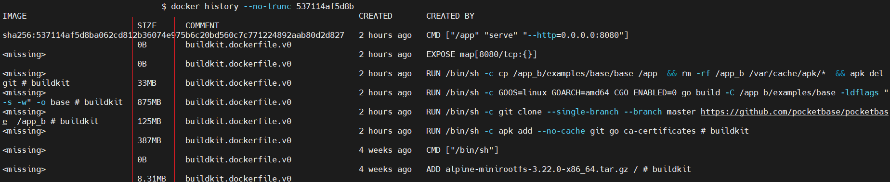
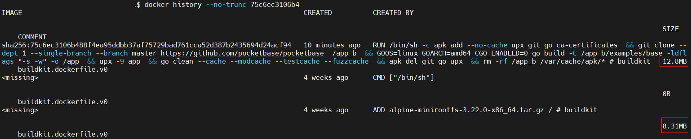
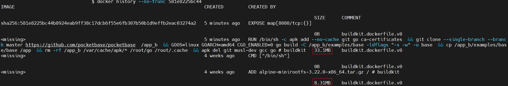

# Shrinking Go app Docker image layers size 


## Task
We have a Dockerfile with Go app:
``` Dockerfile
FROM alpine (3Mb)
COPY {source} (287Mb)
RUN apk add {dependence} (100Mb)
RUN build (10Mb)
```
The size of each layer after the build is specified in parentheses.
Task: Minimize the final image size as much as possible. Write a modified Dockerfile and specify the resulting image size in your answer.
Optional Task*: The Dockerfile should consist of only two lines.
Only the Dockerfile can be modified — the pipeline code cannot be changed.
Assume Docker version before 17 (i.e., version 1.13.1 or earlier) when making changes to the Dockerfile, so we can't use the multi-stage builds or "RUN --mount".

## Solution

1st, we'll upload our source code to any Git repository, so we can pull it from here, but only depth 1.
2nd, we'll rewrite go build step, and finally, we'll delete everything unnecessary after the build.

Here I've made two simple Dockerfiles for different Go versions, because of "build -C /path/" arg in solution dir

## Testing 

We can use [Pocketbase](https://github.com/pocketbase/pocketbase) Go app to test our solution


 Image layers before:
- 8 mb+ alpine base
- 385 Mb+ apk
- 125 Mb+ git clone
- 840 Mb+ go build + 33 Mb app size
  -  Result: 1.43 Gb image size
    


 Image layers after:
- 8 Mb+ alpine base
- 33 Mb app size
  -  Result: 41 Mb image size
    


## Versions

- Docker 27.0.3
- installed on Ubuntu 22.04

## How to test

1. Download Dockerfile
``` bash
curl -o Dockerfile https://github.com/cypher000000/shrink-docker-go/blob/main/testing/Dockerfile_t_after_upx
```
3. Build Docker image from Dockerfile
``` bash
docker build -t cypher000000/shrinkdgo .
```
4. Check created Docker image's layers size
``` bash
docker history --no-trunk cypher000000/shrinkgo
```
 
## UPX
PS:
Also, we can use UPX to shrink Go app more. To do this, we need to add it in the "apk add" line and after "go build line" smth like ```&& upx -9 app \```.
So, if we test this on Pocketbase, we'll get 

 Image layers after:
-  8 Mb+ alpine base
-  13 Mb app size
  -  Result: 21 Mb image size
    


Guide to compress GoLang binaries:
https://github.com/akshaybharambe14/golang-examples/tree/master/binaryCompression

## Credits for demo Go app

@ganigeorgiev for https://github.com/pocketbase/pocketbase
